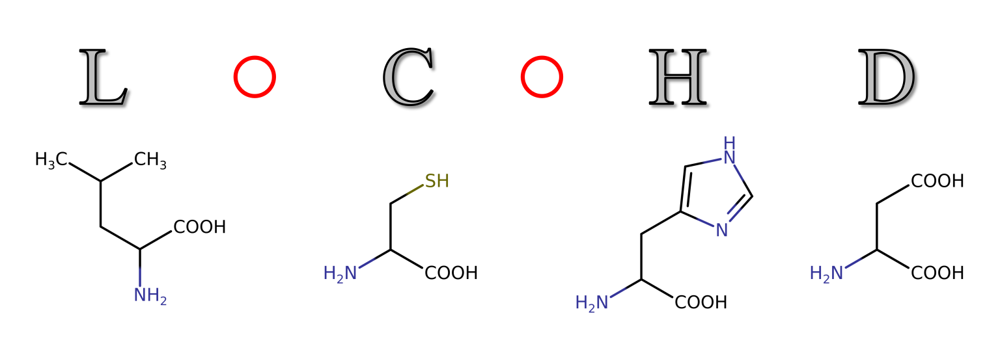

# Welcome to __LoCoHD__!

__LoCoHD__ (_Local Composition Hellinger Distance_) is a metric for comparing protein structures. It can be used for one single structure-structure comparison, for the comparison of multiple structures inside ensembles, or for the comparison of structures inside an MD simulation trajectory. It is also a general-purpose metric for labelled point clouds with variable point counts.

## Where can I read about it?

...

## How can I install it?

...

### From PyPI

...

### Building from source

...

## How can I use it?

...